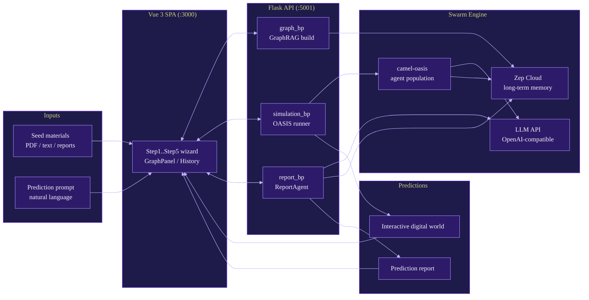

# MiroFish

A simple and universal swarm intelligence engine, predicting anything.

> Upstream: [666ghj/MiroFish](https://github.com/666ghj/MiroFish). This is an Anomalous Ventures mirror; see [`README-EN.md`](./README-EN.md) for the upstream English README and [`DEPLOYMENT_*.md`](./DEPLOYMENT_STATUS.md) notes for local deployment history.

## Table of Contents

- [Overview](#overview)
- [Architecture](#architecture)
- [Quick Start](#quick-start)
- [Development](#development)
- [Testing](#testing)
- [Deployment](#deployment)
- [Sub-Modules](#sub-modules)

## Overview

MiroFish ingests seed materials (news, reports, narratives) and spins up a population of LLM-backed agents with persistent memory. Agents interact inside an OASIS-driven parallel digital world, and a ReportAgent distills the emergent behavior into a prediction report. Users can inject variables mid-run and chat with any agent post-simulation.

Pipeline stages (mirrored by the frontend `Step1..Step5` components):

1. Graph build - seed extraction, memory injection, GraphRAG construction.
2. Environment setup - entity extraction, persona generation, agent config.
3. Simulation - dual-platform (Reddit / Twitter) parallel OASIS runs with dynamic memory updates.
4. Report - ReportAgent synthesis with tool-augmented analysis.
5. Interaction - chat with any agent or with the ReportAgent.

## Architecture



Flask (`backend/app/__init__.py`) registers three blueprints under `/api/{graph,simulation,report}` plus `/health`, and serves the built Vue bundle from `frontend/dist` as an SPA fallback.

## Quick Start

Prereqs: Node.js 18+, Python 3.11-3.12, [`uv`](https://docs.astral.sh/uv/).

```bash
cp .env.example .env      # fill LLM_API_KEY, LLM_BASE_URL, LLM_MODEL_NAME, ZEP_API_KEY
npm run setup:all         # installs root + frontend (npm) + backend (uv sync)
npm run dev               # concurrently runs backend:5001 and frontend:3000
```

Individual services: `npm run backend`, `npm run frontend`.

## Development

- Backend: Flask 3, OpenAI SDK, `camel-oasis==0.2.5`, `camel-ai==0.2.78`, `zep-cloud==3.13.0`, Pydantic, PyMuPDF. See [`backend/README.md`](backend/README.md).
- Frontend: Vue 3 + Vite, per-step components and views under `frontend/src/`. See [`frontend/README.md`](frontend/README.md).
- Standalone experiments: `backend/scripts/run_parallel_simulation.py`, `run_reddit_simulation.py`, `run_twitter_simulation.py`.
- Config surface: `backend/app/config.py` + `config_infrastructure.py`, env-loaded via `python-dotenv`.

## Testing

`pytest` / `pytest-asyncio` are declared in `backend/pyproject.toml` under the `dev` group; no top-level test suite is included in-tree. Add tests under `backend/tests/` and run with `uv run pytest`.

## Deployment

- Docker: `docker compose up -d` pulls `ghcr.io/666ghj/mirofish:latest`, reads `.env`, exposes `3000` and `5001`, mounts `backend/uploads`.
- Source images: `Dockerfile` and `Dockerfile.multiarch` at repo root.
- CI: `.github/workflows/build-deploy.yml` and `docker-image.yml`.
- Operational notes from prior deploys live in `DEPLOYMENT_NOTE.md`, `DEPLOYMENT_PLAN.md`, `DEPLOYMENT_STATUS.md`, `DEPLOYMENT_STATUS_CURRENT.md`, `INTEGRATION.md`, `SESSION_SUMMARY.md`.

## Sub-Modules

- [`backend/`](backend/README.md) - Flask API, OASIS simulation runner, GraphRAG + Zep memory, ReportAgent.
- [`frontend/`](frontend/README.md) - Vue 3 + Vite SPA wizard driving the graph / simulation / report pipeline.
- [`static/`](static/README.md) - Logos, screenshots, and demo assets referenced by docs.

## License

AGPL-3.0. See [`LICENSE`](./LICENSE).
